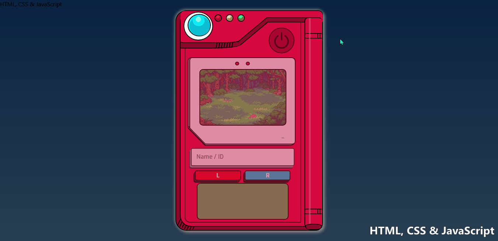
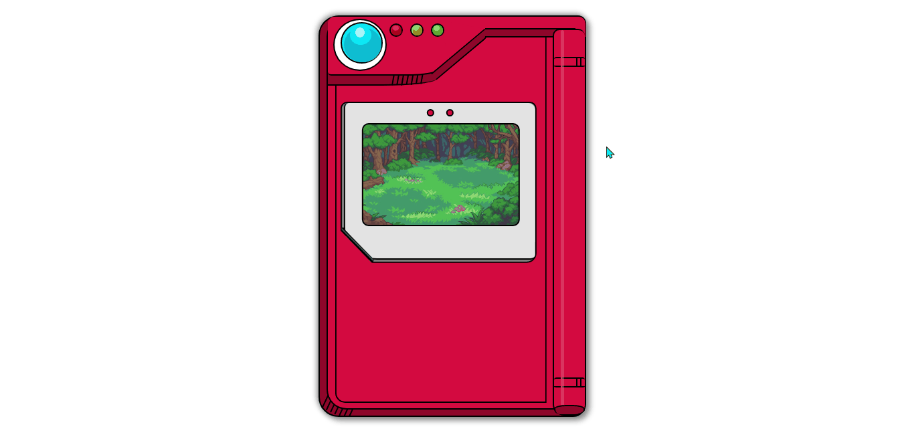

# Modern Pokédex

<!---Esses são exemplos. Veja https://shields.io para outras pessoas ou para personalizar este conjunto de escudos. Você pode querer incluir dependências, status do projeto e informações de licença aqui--->

### Versão com JavaScript:

> Dispositivo Pokédex do anime "Pokémon". Seja em casa no seu desktop, ou na rua com o celular na mão, você pode encontrar o seu Pokémon por aqui!

### Versão sem JavaScript:

> O corpo da Pokédex foi feito inteiramente com HTML e CSS "puro", exceto a floresta no centro da Pokédex, que é uma imagem.

## Objetivo

Inicialmente, a minha ideia era criar uma Pokédex para praticar meus conhecimentos de JavaScript. Mas, depois de pensar um pouco, decidi fazer primeiramente a "carcaça" da Pokédex somente com HTML e CSS, assim eu poderia concretizar o que eu já domino dessas tecnologias.

**
Observação: Eu desenvolvi grande parte da aplicação sem copiar código de algum tutorial. Destaco que me inspirei em um vídeo do Youtube ([créditos aqui](#créditos)), mas me esforcei bastante para diferenciar o meu projeto dos outros, através da criação de features que não estavam contidas no projeto do tutorial.
**

## Acesse o projeto

**
Versão HTML & CSS: <a href="https://guilhermescr.github.io/modern-pokedex/no-javascript/pokedex" target="_blank" rel="external">clique aqui</a>.
**

**
Versão HTML, CSS & JavaScript: <a href="https://guilhermescr.github.io/modern-pokedex/with-javascript/modern-pokedex" target="_blank" rel="external">clique aqui</a>.
**

## Features da Versão JS

  <ul style="display: flex; flex-direction: column; gap: 15px;">
    <li>Design responsivo.</li>
    <li>Integração de API (PokéAPI).</li>
    <li>Botão de power para ligar/desligar a Pokédex.</li>
    <li>Animação ao ligar a Pokédex.</li>
    <li>Campo de busca para encontrar um Pokémon.</li>
    <li>Botões para encontrar o Pokémon anterior ou posterior.</li>
    <li>Display com os status (vida, dano, defesa etc.) do Pokémon encontrado.</li>
  </ul>

## Mais informações sobre o projeto

Para desenvolver a Modern Pokédex, eu tive que consumir a <a href="https://pokeapi.co/" target="_blank" rel="external">PokéAPI</a> pelo método fetch() do JavaScript. Utilizada a requisição HTTP "GET".

### Como encontrar um Pokémon

Existem dois jeitos de encontrar um Pokémon: pelo nome ou pelo ID.

#### Pelo ID:

Você pode procurar, por exemplo, o pokémon de número 82 (sem zero à esquerda), ou com um zero como primeiro caractere. Exemplo: 082.

#### Pelo Nome:

Os formatos aceitos são:

- Letras maiúsculas.
- Letras minúsculas.
- Letras maiúsculas misturadas com minúsculas.

## Créditos

Aproveitando que você chegou ao fim desta documentação, eu gostaria de te dizer que eu usei o mesmo estilo de fontes e input (campo de busca) do projeto do <a href="https://www.youtube.com/c/ManualdoDev" target="_blank" rel="external">@Manual do Dev</a>. Além disso, segui as instruções do vídeo dele para desenvolver a funcionalidade básica de consumir a PokéAPI. Por fim, a minha inspiração para desenvolver a "carcaça" da Pokédex veio da imagem que ele utilizou no projeto.

<strong>Vídeo: <a href="https://www.youtube.com/watch?v=SjtdH3dWLa8" target="_blank" rel="external">"Como criar uma Pokedex com HTML, CSS e JavaScript"</a></strong>

## Não pare por aqui!

Gostou do meu projeto? Então me acompanhe nas redes sociais, principalmente no LinkedIn, para ficar por dentro das minhas últimas aplicações!

- [Linkedin](https://www.linkedin.com/in/guilhermescr/)
- [Instagram](https://www.instagram.com/guiidev_/)

*Developed by Guilherme Rocha - 2022.*

[⬆ Voltar ao topo](#modern-pokédex) 